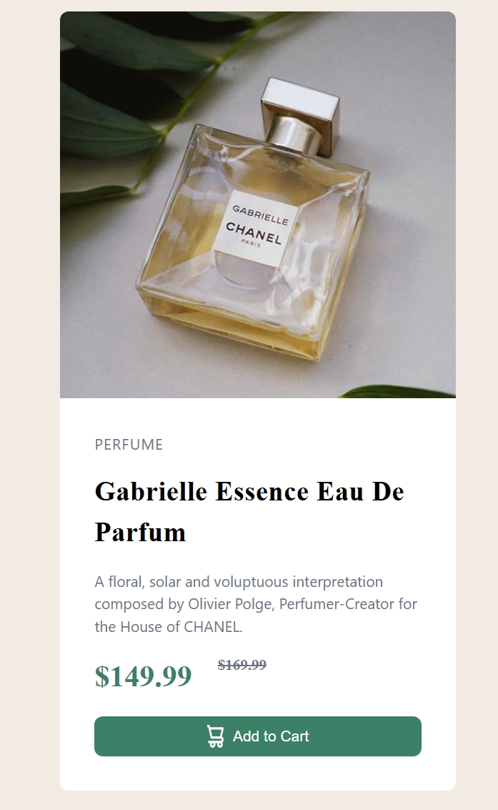

# Frontend Mentor - Product preview card component solution

This is a solution to the [Product preview card component challenge on Frontend Mentor](https://www.frontendmentor.io/challenges/product-preview-card-component-GO7UmttRfa). Frontend Mentor challenges help you improve your coding skills by building realistic projects. 

## Table of contents

- [Overview](#overview)
  - [The challenge](#the-challenge)
  - [Screenshot](#screenshot)
  - [Links](#links)
- [My process](#my-process)
  - [Built with](#built-with)
  - [What I learned](#what-i-learned)
  - [Continued development](#continued-development)
- [Author](#author)

## Overview
I Completed the frontend mentor challeng of creating a product preview card using **HTML** and **Tailwind CSS**. I used flex in building it and i leanrt how to use hidden and block to display and hide element in different device size.
### The challenge

Users should be able to:

- View the optimal layout depending on their device's screen size
- See hover and focus states for interactive elements

### Screenshot

### Links

- Solution URL: [solution URL here](https://product-preview-card-beryl-nu.vercel.app/)

## My process
i will say frontend mentor has taken me from 1% to 10%. It has really helped me increase my css skills.

### Built with

- HTML5 markup
- Tailwind CSS
- Flexbox
- CSS Grid
- Vercel for deployment

### What I learned

Ilearnt how to use the hidden and block to display different content on desktop and mobile device

### Continued development

I will continue to focus on the following areas:
- Flex
- Grid
- Responsive design

## Author

- Linkedin - [Chisom Worlu](https://www.linkedin.com/in/chisomworlu)
- Frontend Mentor - [@Chisomworlu12](https://www.frontendmentor.io/profile/Chisomworlu12)
- Twitter - [@chisomwo](https://x.com/chisomwo)

